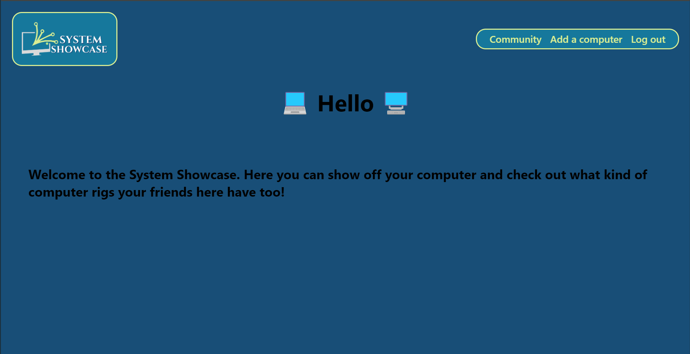
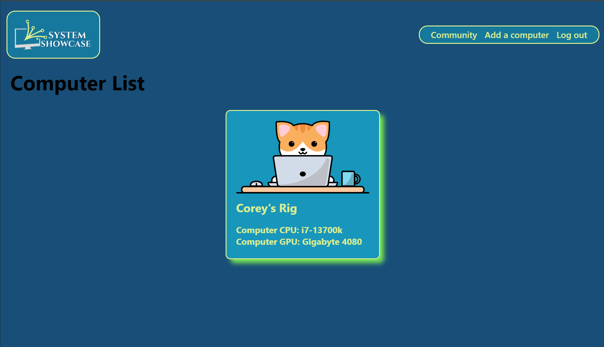
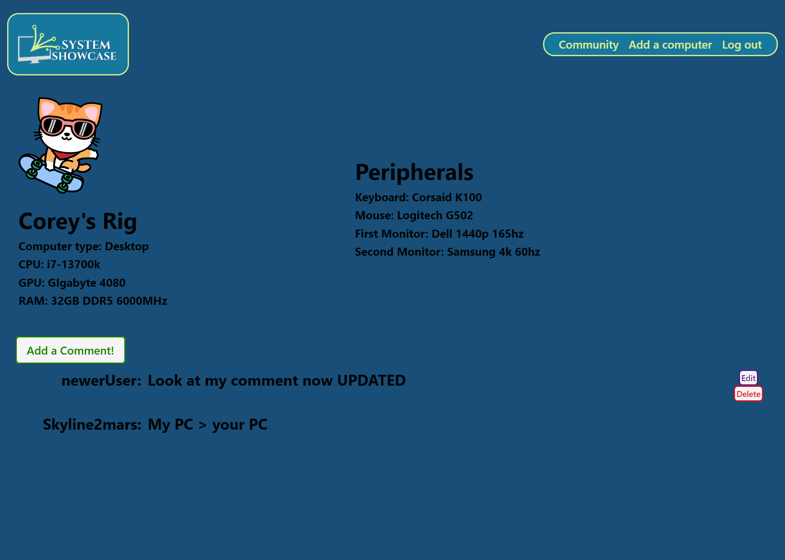
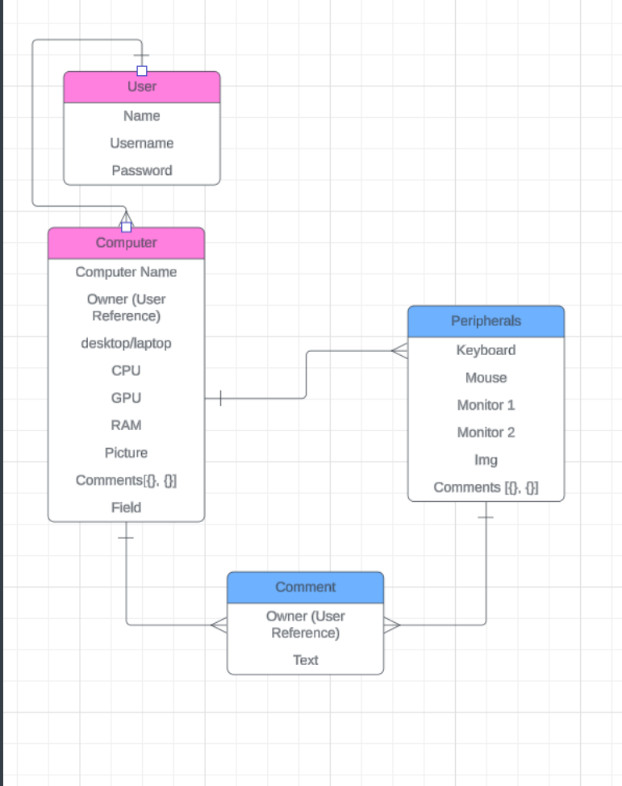
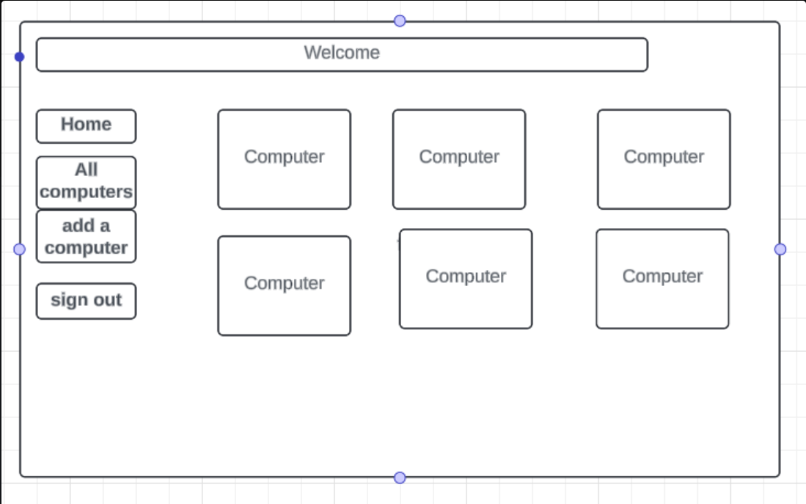
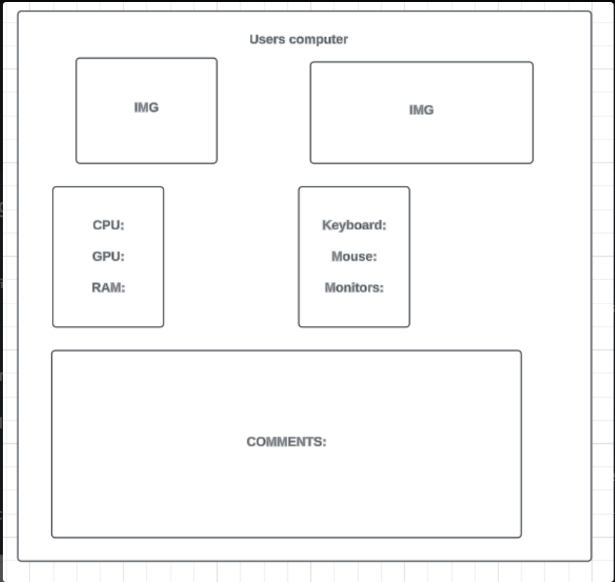

# System Showcase
Welcome to the System Showcase!

Join us to share, discuss, and flaunt your incredible computer rigs. Here, you can:

Showcase Your Build: Add your computer to the community and see how it stacks up against your friends' setups.
Connect with Fellow Enthusiasts: Leave comments to compliment your friends on their rigs or boast about how your hardware outperforms theirs.
Stay Inspired: Explore the latest in cutting-edge technology and get ideas for your next upgrade.
Dive into the System Showcase now and be a part of our vibrant community of tech enthusiasts!

I made this while at General Assembly using Django & Python.

## Instructions
Jump on in: https://system-showcase-843b11209f2a.herokuapp.com/
You can either look around or sign up to get started interacting! 
##  Sneak Peek

##  Planning 

##  Technologies used

##  Attributions
Fonts: https://fonts.google.com/
 
Logo art: https://www.canva.com/

##  Realizations Along the Development Journey
During my time this week working on the project I found out just how much I have learned in the previous weeks. I was surprised to see how more comfortable I felt writing the code and language, and how much more sense it truly made to me compared to previous projects. 

##  Next Steps
&#9744; Implement user picture upload to share computer build pictures. 
 
&#9744; Add a field a response to a computer stress test for users to share, and make graphs or other visual interpretaions of the data